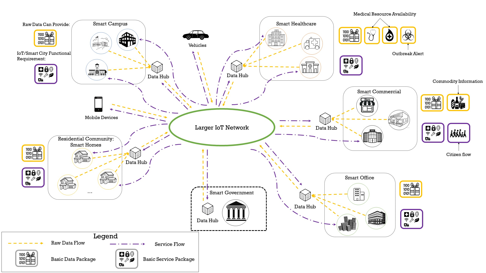

# Internet of Things Enabled Data Acquisition Framework for Smart Building Applications
This is a research program initiated by Dr. Ray Gao, formerly known as Xinghua Gao, in 2018, while he was working on his PhD research under the guidance of Dr. Pardis Pishdad-Bozorgi and Dr. Dennis Shelden at the Georgia Institute of Technology. As a component of Dr. Gao’s PhD thesis, the initial idea was to use the Internet of Things (IoT) to establish the “nervous system” of buildings, thereby creating the data foundation for future smart buildings. 

In the years that followed, this research program gave rise to multiple associated projects, including:

- Building Data Lite: a cost-effective, scalable, and portable IoT data infrastructure for indoor environment sensing
- A framework of developing machine learning models for facility life-cycle cost analysis
- A human-centered approach to smart housing: building occupant persona development
- Smart building interoperability: integrated Building Information Modeling (BIM)-IoT data standards
- Assistance from the Ambient Intelligence: Cyber–physical system applications in smart buildings for cognitively declined occupants

## Vision for the Future Smart City—An IoT Network of Smart Facilities

Based on the initial IoT-enabled facility data acquisition framework described in [this paper](Papers/IoT_Framework.pdf), Dr. Gao proposes a vision for the future smart city: a network of smart buildings connected by IoT.

In the envisioned IoT-enabled smart city, a network of smart buildings forms a city, each providing real-time data to the network. This data, collectively termed as the "basic facility data package" (BFDP), forms the foundation of various smart city applications. In addition to this, specific facilities provide "extra data", such as healthcare facilities providing medical resource information, or supermarkets providing real-time commodity data. These buildings not only provide data but also require services, referred to as the "basic facility service package" (BFSP) which includes security and emergency assistance among others. Some facilities might need "extra services", such as a shopping mall requesting real-time citizen flow information. The Cyber Physical System (CPS), acting as the city's heart, connects and synchronizes the physical and digital aspects of the city in real-time, thus offering extensive data analytics opportunities. It facilitates performance assessment against targets, future predictions based on historical data, and enables autonomous control and response to citizens' needs.

## This Repository and the Source Code

This repository serves as the index for the related research results and legacy code developed in the early stages, as described in [this paper](Papers/IoT_Framework.pdf).

## Project Team and Contributors

[Dr. Ray Gao](http://www.raygaoai.com/)

[Sheik Murad Hassan Anik (soon to be PhD)](https://www.linkedin.com/in/anik801/)

[Dr. Na Meng](https://people.cs.vt.edu/nm8247/)

[Dr. Pardis Pishdad-Bozorgi](https://bc.gatech.edu/people/pardis-pishdad-bozorgi)

[Dr. Dennis Shelden](https://www.case.rpi.edu/people/dennis-shelded)

[Dr. Angelos Stavrou](https://computing.ece.vt.edu/~angelos/)

[Dr. Shu Tang](https://www.xjtlu.edu.cn/en/departments/academic-departments/civil-engineering/staff/shu-tang)
